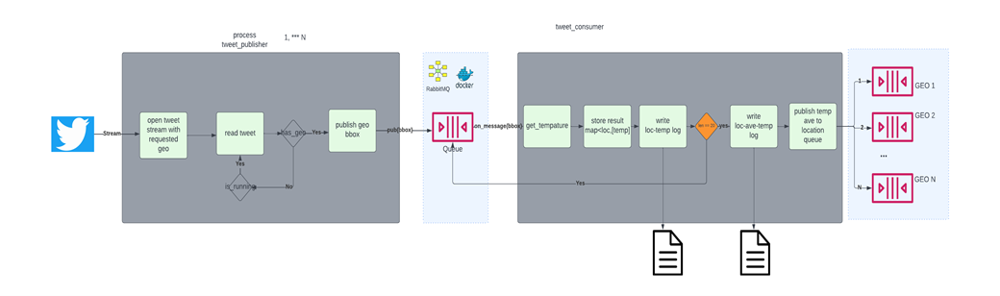
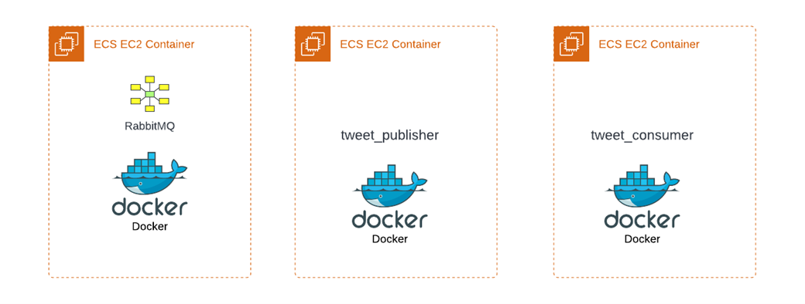

### Requirements
  - #### Continuously calculate the sliding avg of the temperatures from Tweets across all locations of the last n tweets.
  - ####  The number 'sliding average n' should be configurable at startup time. 
  - #### The input value ‘n’ should be between 2 and 100
  - #### The output of your pipeline should be 2 files
    - file for the stream of loc/temperatures in fahrenheit
    - file for the stream of the sliding loc/averages.
  - ####  provide a high-level diagram of how you would deploy your solution
  
---

### Functional requirements
- The number of tweets to calculate the sliding average over should be configurable at startup time. 
- The input value ‘n’ should be between 2 and 100
- The output of your mini-pipeline should be 2 files, one for the stream of temperatures in fahrenheit and 1 file for the stream of the sliding averages.

### Non functional requirements
- Your solution should be
  - [x] efficient
  - [x] scalable
- If you are relying on any libraries or frameworks
  - request
  - pika
    - [x] best practices in the ecosystem.
- We will be evaluating your code for 
  - [X] readability
  - [X] correctness. 
- Treat this like a work submission
  - THIS MEANS 
    - [ ] tests positive and negative
    - [x] proper formatting
    - [x] proper naming
    - [x] proper documentation
    - [x] proper error handling
    - [x] proper logging logging

  
### Overview

- This solution is a message queue solution. 
- Tweets consumer(s) filtering tweets that have geolocation. 
- The geoloaction bound-box is published to a queue Q. 
- Message listener(s) on Q 
  - computed the centroid 
  - contract the Weather API to get the temperature and extended geolocation. 
  - The temperature are correlated by location. 
  - The sliding averages are computed accordingly softly. 
  - The loc/temp data is logged to a files. We have two files, the temp/loc and loc/ave(n) file. 
  - The files are under logs directory.


logs/Temperatures.csv
```csv
Germany-Hessen-Wehlheiden,39.2
Somalia-Jubbada Hoose-Mido,77.9
Yemen-Dhamar-Samhon,72.9
Seychelles Islands-Beau Vallon-Anse Volbert Village,81.1
```
logs/Averages.csv
```csv
United States of America-Kansas-Mount Vernon, 36.28
```

---

 

### Remark: 
- Twitter Streaming API Streams provides about 1% of all Tweets in real-time. 
- About 1% of streamer tweets have geo-location

### Scaling

- run more publisher to scale on tweet publisher
- run more consumers to scale on temperature averages

## Running the code
- git clone git@github.com:stjohnd777/twitter_heat.git
- docker
  - https://hub.docker.com/_/rabbitmq
  - docker pull rabbitmq
  - docker run -it --rm --name rabbitmq -p 5672:5672 -p 15672:15672 rabbitmq:3.9-management
- cd twitter_head
- pip install pika
- pip install requests

### Many possible deployment

- The simplest

 
---
### Running the code

- option 1
  - run publishers and consumers as process
  - py mq/publish_tweet.py
  - py mq/consume_tweet.py
  - one can run many publishers and consumers
- option 2
  - py mq/main.js
  - configure number_temp_listeners and number_temp_listeners in Globals 
  - option one scales in process option two scales in thread

Remark:
- More effort needed here with threading and process, but for this exercise with time box it was not done.
- Unit Testing is needed, but for this exercise with time box it was not done.

### Remark Critical
- Can not scale tweet consumers as is
- Can do it with one more queue
- We can talk about this


---
### configuration option are in the globals.py

```python

class Globals:
    is_console_printing = True
    number_temp_listeners =1
    number_temp_listeners = 1
    uri_tweet_stream = ''
    headers_tweet_stream = 
    sliding_ave_number = 5
    @staticmethod
    def getWeatherUri(lat,lon):
        uri_weather = f"http://api.weatherapi.com/v1/forecast.json?key=2d15b642528c4b7093412604221202&q={lat},{lon}&days=1&aqi=no&alerts=no"
        return uri_weather
    rabbit_host = "localhost"
    tweets_with_geo_queue = 'Q2'
    log_file_publisher = 'twitter_publisher.log'
    log_file_consumer = 'twitter_consumer.log'
    mapGeoToTemp = {}
```

